# Vue学习笔记

**By WHU_Lix**

[toc]

# Vue.js安装

1. 直接CDN引入

   - 开发环境版本或生产环境版本：

     ```html
     <!--开发环境版本-->
     <script src="https://cdn.jsdelivr.net/npm/vue/dist/vue.js"></script>
     <!--生产环境版本-->
     <script src="https://cdn.jsdelivr.net/npm/vue@2.6.12"></script>
     ```

2. 下载和引入

   开发版本：https://cn.vuejs.org/js/vue.js

   生产版本：https://cn.vuejs.org/js/vue.min.js

3. npm安装


# 初探Vue.js

## Demo1

- demo:

  ```html
  <!DOCTYPE html>
  <html lang="en">
  <head>
      <meta charset="UTF-8">
      <title>Title</title>
  
  </head>
  <body>
  
  <div id="app" >
      <h1>{{message}}</h1>
      <h2>{{message}}</h2>
  </div>
  <script src="../js/vue.js"></script>
  <script>
      //let(ES6中定义变量)/const(常量)
      //声明式编程
  
      const app = new Vue({
          el:'#app',  //用于挂载要管理的元素
          data:{  //定义数据
              message:'123'
          }
  
      })
      //原始js：(命令式编程）
      //1.创建div元素
      //2.设置id属性
      //3.定义一个变量叫message
      //4.将message放在之前的div元素中显示
  
  </script>
  </body>
  </html>
  ```

- 代码做的事情:
  - 创建了一个Vue对象
  - 创建Vue对象的时候传入了一些options:{}
    - {}中包含了el属性，该属性决定了这个Vue对象挂载到哪一个元素（此处挂载到了id为app的元素上）
    - {}中包含了data属性：该属性中通常会存储一些数据，这些数据可以是我们直接定义，也可以是来自网络或服务器
- 浏览器执行代码的流程：
  - 执行到10-13行显示出对应的HTML
  - 执行第16行时创建Vue实例，并对院HTML进行解析和修改

## Demo2

- demo

  ```html
  <!DOCTYPE html>
  <html lang="en">
  <head>
      <meta charset="UTF-8">
      <title>Title</title>
  </head>
  <body>
  <div id="app">
      <ul>
          <li v-for="item in List">{{item}}</li>
      </ul>
  </div>
  <script src="../js/vue.js"></script>
  <script>
      const app = new Vue({
          el:'#app',
          data:{
              List:['First','Second','Third']
          }
  
      })
  </script>
  
  </body>
  </html>
  ```

- Vue列表的展示：v-for:"item in List"

## Demo3 计数器

- 新的属性：methods：用于在Vue对象中定义方法
- 新的指令：v-on:click=”method“:用于监听某个元素的点击事件，并且需要制定当发生点击时，执行的方法（方法通常是methods中定义的方法）
  - 语法糖：@click=“method”

## Vue中的MVVM

- MVVM：Modal-View-Viewmodal

  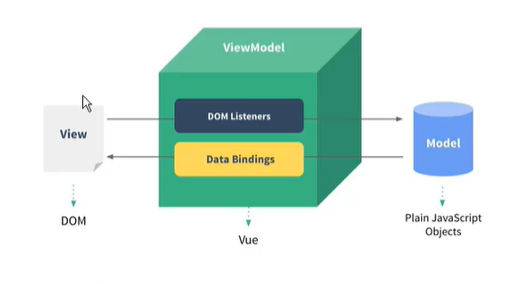

## 创建Vue实例传入的options

- el:
  - 类型：string/HTMLElement
  - 决定之后Vue实例管理哪一个DOM
- data
  - 类型：Object/Function(组件当中data必须是一个函数)
  - 作用：Vue实例对应的数据对象
- methods
  - 类型：{[key:string]:Function}
  - 作用：定义属于Vue的一些方法，可以在其他地方调用，也可以在指令中调用

## Vue的生命周期


# 基本语法

## 插值操作

### Mustache

通过Mustache语法（双大括号）将data中的数据插入到HTML中，双大括号中可以写表达式

### 其他指令：v-once v-html v-text v-pre v-cloak

1. v-once：

   该指令后面不需要跟任何表达式，该指令表示元素和组件只渲染一次，不会随着数据的改变而改变：

   ```html
   <h2 v-once>{{message}}</h2>
   ```

2. **v-html：**

   有时候从服务器请求的数据是一段html代码，如果通过{{}}来输出，会将html代码一起输出，此时若希望按照html格式进行解析并显示对应内容，可用v-html指令

   - 该指令后面往往会跟上一个string类型
   - 会将string的hetml解析出来并且进行渲染

   比如：

   ```html
   <body>
   <div id="app">
     <h2 v-once>{{message}}</h2>
     <h2 v-html="link"></h2>
   </div>
   <script src="../js/vue.js"></script>
   <script>
     const app = new Vue({
       el:'#app',
       data:{
         message:'hello vue',
         link:'<a href="http://www.baidu.com">百度一下</a>'
       }
     })
   </script>
   ```

   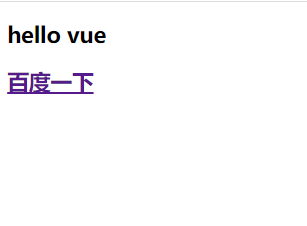

3. v-text:

   与{{}}显示信息相似：

   ```html
   <div id="app">
     <h2 v-once>{{message}}</h2>
     <h2 v-html="link"></h2>
     <h2 v-text="message"></h2>
   </div>
   <script src="../js/vue.js"></script>
   <script>
     const app = new Vue({
       el:'#app',
       data:{
         message:'hello vue',
         link:'<a href="http://www.baidu.com">百度一下</a>'
       }
     })
   </script>
   ```

   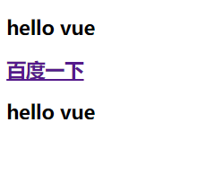

   - 一般不用，因为不够灵活，会覆盖掉标签内的文本，不能进行拼接。

4. v-pre：

   用于跳过这个元素和它的子元素的变异过程，用于显示原本的mustache语法。

   ```html
   <div id="app">
     <h2 v-once>{{message}}</h2>
     <h2 v-html="link"></h2>
     <h2 v-text="message"></h2>
     <h2 v-pre>{{message}}</h2>
   </div>
   <script src="../js/vue.js"></script>
   <script>
     const app = new Vue({
       el:'#app',
       data:{
         message:'hello vue',
         link:'<a href="http://www.baidu.com">百度一下</a>'
       }
     })
   </script>
   ```

   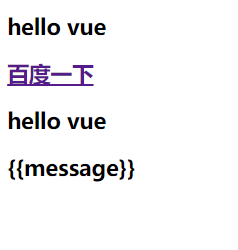

5. v-cloak

   在解析之前，div中有一个属性v-cloak，在vue解析之后，div中没有一个属性cloak，可以给v-cloak设施css样式display=none来在渲染之前使html元素不显示。

   ```html
   <!DOCTYPE html>
   <html lang="en">
   <head>
     <meta charset="UTF-8">
     <title>Title</title>
     <style>
       [v-cloak]{
         display: none;
       }
     </style>
   </head>
   <body>
   <div id="app" v-cloak>
     {{message}}
   </div>
   <script src="../js/vue.js"></script>
   <script>
     setTimeout(function () {
       const app = new Vue({
         el:'#app',
         data:{
           message:'hello'
         }
       })
     },1000)
   
   </script>
   </body>
   </html>
   ```

## 绑定属性：v-bind

1. v-bind

   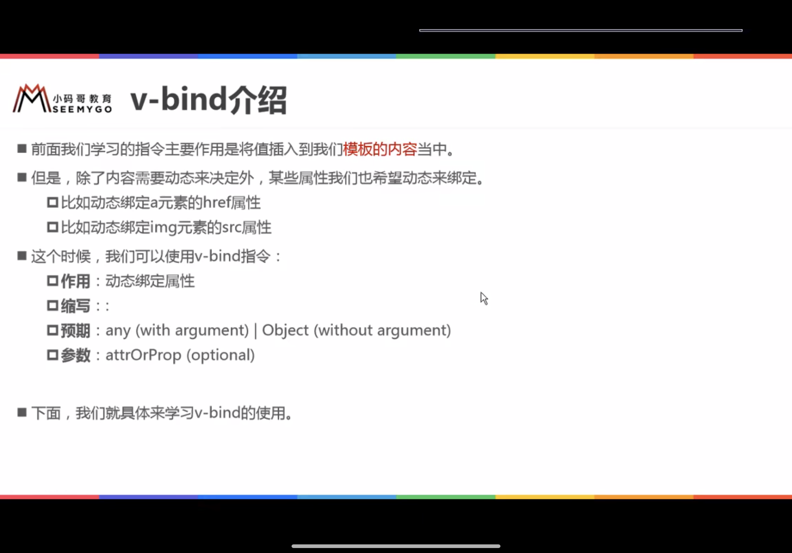

   **语法糖：不写v-bind，直接写一个冒号**

   - v-bind动态绑定class：

     对象语法

     数组语法

   - v-bind动态绑定style：

     对象语法

     数组语法

## 计算属性：computed

**相比methods，计算属性有缓存，比methods效率更高**

- getter和setter：

  计算属性有get和set函数

  ```html
  <!DOCTYPE html>
  <html lang="en">
  <head>
    <meta charset="UTF-8">
    <title>Title</title>
  </head>
  <body>
  <div id="app">
    <h2>{{fullName}}</h2>
  </div>
  <script src="../js/vue.js"></script>
  <script>
    const app=new Vue({
      el:'#app',
      data:{
        firstName:'Kobe',
        lastName:'Bryant'
      },
      methods:{
        getFullName(){
          return
        }
      },
      computed:{
        fullName:{
          get:function () {
            console.log("调用了get");
            return this.firstName+' '+this.lastName
          },
          set:function (newValue) {
            const names = newValue.split(' ');
            this.firstName=names[0];
            this.lastName=names[1];
            console.log("调用了set");
          }
        }
  
      }
    })
  </script>
  </body>
  </html>
  ```

  

- 计算属性和methods的对比：

  计算属性对应的函数结果会被缓存，methods不会，从而在大量调用时计算属性的效率更高


## 事件监听：v-on

### v-on

- 作用：绑定事件监听器

- 缩写：@

- 预期：Function|Inline Statement|Object

- 参数：event：

  - 无参时刻不写括号

  - 当定义的函数有参而v-on没传参时，默认将浏览器生产的event事件对象作为参数传入到方法

  - 方法定义时，需要event对象，又需要其他参数时，手动获取浏览器参数的event对象，使用“$event"作为参数传入。

- 修饰符：Vue提供了修饰符来帮助方便的处理一些时间

  - .stop-调用event.stopPropagation()，阻止父元素的事件
  - .prevent-调用event.preventDefault()，阻止默认事件
  - .{KeyCode|KeyAlias}-只当时间是从特定键位触发时才触发回调
  - .native-监听组件根元素的原生事件
  - .once-只触发一次回调

  ```html
  <!DOCTYPE html>
  <html lang="en" xmlns:v-on="http://www.w3.org/1999/xhtml">
  <head>
    <meta charset="UTF-8">
    <title>Title</title>
  </head>
  <body>
  <!--stop修饰符的使用-->
  <div id="app">
    <div @click="divClick">
      aaaaaaaa
      <button @click.stop="btnClick">按钮</button>
    </div>
    <!--prevent修饰符的使用-->
    <br>
    <form action = "baidu">
      <input type="submit" value="提交" @click.prevent="submitClick">
    </form>
    <!--监听某个按键的点击-->
    <input type="text" @keyup.enter="keyClick">
    <!--once的使用-->
    <br>
    <button @click.once="btn2Click">按钮2</button>
  </div>
  
  <script src="../js/vue.js"></script>
  <script>
    const app = new Vue({
      el:'#app',
      data:{
        message:'hello'
      },
      methods:{
        btnClick() {
          console.log("btnClick");
        },
        divClick(){
          console.log("divClick");
        },
        submitClick(){
          console.log("submitClick");
        },
        keyClick(){
          console.log('keyup');
        },
        btn2Click(){
          console.log('btn2Click');
        }
      }
    })
  </script>
  </body>
  </html>
  ```

  


## 条件判断：v-if v-else-if v-else

- v-if v-else-if v-else
- v-show
  - v-if: 当我们条件为false时，包含v-if指令的元素，根本就不会存在于dom中
  - v-show:当条件为false时，v-show只是给我们的元素增加了一个行内样式：display:none
  - 开发中当显示和隐藏切换很频繁时使用v-show，只有一次切换时，使用v-if


## 循环遍历：v-for

### 遍历数组

```html
<!DOCTYPE html>
<html lang="en">
<head>
  <meta charset="UTF-8">
  <title>Title</title>
</head>
<body>
<div id="app">
<!--  在遍历过程中不使用索引值-->
  <ul>
    <li v-for="item in names">{{item}}</li>
  </ul>
  <!--  在遍历过程中使用索引值-->
  <ul>
    <li v-for="(item,index) in names">{{index+1}}.{{item}}</li>
  </ul>
</div>
<script src="../js/vue.js"></script>
<script>
  const app = new Vue({
    el:'#app',
    data:{
      message:'hello',
      names:['whu','kobe','james','curry']
    }
  })
</script>

</body>
</html>
```


### 遍历对象

```html
<!DOCTYPE html>
<html lang="en">
<head>
  <meta charset="UTF-8">
  <title>Title</title>
</head>
<body>
<div id="app">
  <!--只获取一个值时，获取到的是value-->
  <ul>
    <li v-for="item in info">{{item}}</li>
  </ul>
  <!--使用元组获取key,value对-->
  <ul>
    <li v-for="(value,key) in info">{{key}}-{{value}}</li>
  </ul>
  <!--同时也获取index-->
  <ul>
    <li v-for="(value,key,index) in info">{{key}}-{{value}}-{{index}}</li>
  </ul>
</div>
<script src="../js/vue.js"></script>
<script>
  const app = new Vue({
    el:'#app',
    data:{
      info:{
        name:'lix',
        age:'20',
        type:'student'
      }
    }
  })
</script>
</body>
</html>
```

### 组件的key属性（提高效率)

官方推荐我们在使用v-for时，给对应的元素或者组件加上一个:key属性，

使用key属性和Vue的虚拟DOM的Diff算法有关系，使用key来给每一个节点做一个唯一标识，可以使diff算法正确的识别此节点，并且找到正确的位置插入新的节点

所以key的作用主要是为了高效地更新虚拟dom


### 数组中响应式的方法

https://www.bilibili.com/video/BV15741177Eh?p=39(待补全)


## 表单绑定：v-model

- 表单控件在实际开发中非常常见，特别对于用户信息的提交，需要大量的表单

- Vue中使用v-model指令来实现表单元素和数据的双向绑定

  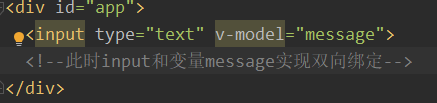

  此时：

  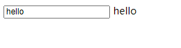

  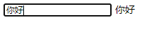

  此时页面元素和message变量双向绑定，修改任何一个都会导致另一个的修改。

- 双向绑定的本质：（非底层原理，仅理解）

  v-model相当于两个指令的结合：v-bind和v-on

  ```html
  <!DOCTYPE html>
  <html lang="en">
  <head>
    <meta charset="UTF-8">
    <title>Title</title>
  </head>
  <body>
  <div id="app">
    <input type="text" :value="message" @input="valueChange">
    <h2>{{message}}</h2>
    <!--此时input和变量message实现双向绑定-->
  
  </div>
  <script src="../js/vue.js"></script>
  <script>
    const app = new Vue({
      el:'#app',
      data:{
        message:'hello'
      },
      methods:{
        valueChange(event){
          this.message=event.target.value
        },
      }
    })
  </script>
  </body>
  </html>
  ```

- v-model也可以用于textarea元素


### v-model:radio

```html
<!DOCTYPE html>
<html lang="en">
<head>
  <meta charset="UTF-8">
  <title>Title</title>
</head>
<body>
<div id="app">
  <label for="male">
    <input type="radio" id="male" value="男" v-model="sex">男
  </label>
  <label for="female">
    <input type="radio" id="female" value="女" v-model="sex">女
  </label>
  <h2>您选择的性别是：{{sex}}</h2>
</div>
<script src="../js/vue.js"></script>
<script>
  const app = new Vue({
    el:'#app',
    data:{
      message:'hello',
      sex: '男'
    }
  })
</script>
</body>
</html>
```


### v-model结合checkbox(单选和多选)

```html
<!DOCTYPE html>
<html lang="en">
<head>
  <meta charset="UTF-8">
  <title>Title</title>
</head>
<body>
<div id="app">
  <!--单选框,对应boolean值-->
  <label for="license">
    <input type="checkbox" id="license" v-model="isAgree">同意协议
  </label>
  <h2>{{isAgree}}</h2>
  <!--多选框，对应数组类型-->
    <input type="checkbox" value="篮球" v-model="hobby">篮球
    <input type="checkbox" value="足球" v-model="hobby">足球
    <input type="checkbox" value="乒乓球" v-model="hobby">乒乓球
    <input type="checkbox" value="羽毛球球" v-model="hobby">羽毛球
  <h2>您选择的爱好是：{{hobby}}</h2>
</div>
<script src="../js/vue.js"></script>
<script>
  const app = new Vue({
    el:'#app',
    data:{
      message:'hello',
      isAgree:false,
      hobby:[]
    }
  })
</script>
</body>
</html>
```

单选就是定义一个单一变量，多选就是定义一个数组类型


### v-model结合select（单选、多选）

```html
<!DOCTYPE html>
<html lang="en">
<head>
  <meta charset="UTF-8">
  <title>Title</title>
</head>
<body>
<div id="app">
  <!--1.选择一个-->
  <select name="abc" v-model="fruit">
    <option value="苹果" >苹果</option>
    <option value="香蕉" >香蕉</option>
    <option value="榴莲" >榴莲</option>
    <option value="葡萄" >葡萄</option>
  </select>
  <h2>您选择的水果是{{fruit}}</h2>
  <!--2.选择多个-->
  <select name="abc" v-model="fruits" multiple>
    <option value="苹果" >苹果</option>
    <option value="香蕉" >香蕉</option>
    <option value="榴莲" >榴莲</option>
    <option value="葡萄" >葡萄</option>
  </select>
  <h2>您选择的水果是{{fruits}}</h2>
</div>
<script src="../js/vue.js"></script>
<script>
  const app = new Vue({
    el:'#app',
    data:{
      message:'hello',
      fruit:'苹果',
      fruits:[]
    }
  })
</script>
</body>
</html>
```

单选就是定义一个单一变量，多选就是定义一个数组类型


### Vue中的值绑定

v-bind在input中的应用：

```
<!DOCTYPE html>
<html lang="en">
<head>
  <meta charset="UTF-8">
  <title>Title</title>
</head>
<body>
<div id="app">
  <!--单选框,对应boolean值-->
  <label for="license">
    <input type="checkbox" id="license" v-model="isAgree">同意协议
  </label>
  <h2>{{isAgree}}</h2>
  <!--多选框，对应数组类型-->
  <input type="checkbox" value="篮球" v-model="hobby">篮球
  <input type="checkbox" value="足球" v-model="hobby">足球
  <input type="checkbox" value="乒乓球" v-model="hobby">乒乓球
  <input type="checkbox" value="羽毛球" v-model="hobby">羽毛球
  <h2>您选择的爱好是：{{hobby}}</h2>

  <label v-for="item in originHobbies" :for="item">
    <input type="checkbox" :value="item" v-model="hobby" :id="item">{{item}}
  </label>

</div>
<script src="../js/vue.js"></script>
<script>
  const app = new Vue({
    el:'#app',
    data:{
      message:'hello',
      isAgree:false,
      hobby:[],
      originHobbies:['篮球','足球','乒乓球','羽毛球']
    }
  })
</script>
</body>
</html>
```

效果如下

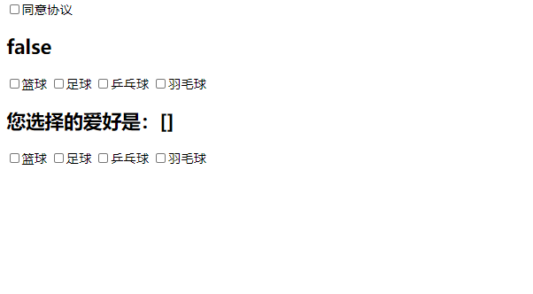

### v-model修饰符

- lazy
  - 默认情况下，v-model默认在input事件中同步输入框的数据
  - 一旦有数据发生改变，对应的data中的数据局就会自动发生改变
  - lazy修饰符可以让数据在失去焦点或者回车时才会更新
- number
  - 默认情况下，在输入框中无论输入字符串还是数字都会被当作字符串类型处理
  - 如果我们希望处理的是数字类型，最好直接将内容当做数字处理
  - number修饰符可以让输入框中输入的内容自动转成数字类型
- trim
  - 如果输入的内容首尾有很多空格，通常我们希望将其取出
  - trim修饰符可以过滤内容左右两边的空格


## 过滤器

定义方法：和methods等相似：

```js
//过滤器
  filters:{
    showPrice(price){
      return '￥'+price.toFixed(2);
    },
```

使用方法：

```html
<!--过滤器写法-->
<td>{{item.price | showPrice}}</td>
```


# 组件化开发（重要）

## Vue组件化思想

- 组件化是Vue中的重要思想
  - 它提供了一种抽象，让我们可以开发出一个个独立可复用的小组件来构造我们的应用
  - 任何的应用都会被抽象成一颗组件树

## 注册组件的基本步骤

- 组件的使用分成三个步骤：
  - 创建组件构造器（调用Vue.extend()方法）
  - 注册组件（调用Vue.component()方法）
  - 使用组件（在Vue实例的作用范围内使用组件）

```javascript
<!DOCTYPE html>
<html lang="en">
<head>
  <meta charset="UTF-8">
  <title>Title</title>
</head>
<body>
<div id="app">
  <!--使用组件-->
  <my-cpn></my-cpn>
</div>
<script src="../js/vue.js"></script>
<script>
  //1.创建组件构造器对象
  const cpnConstructor = Vue.extend({
    template:`
    <div>
      <h2>我是标题</h2>
      <p>我是内容1</p>
      <p>我是内容2</p>
    </div>`
  })
  //2.注册组件
  Vue.component('my-cpn',cpnConstructor)

  const app = new Vue({
    el:'#app',
    data:{
      message:'hello'
    }
  })
</script>
</body>
</html>
```

1. Vue.extend()
   - 调用Vue.extend()创建的是一个组件构造器
   - 通常在创建组件构造器时，传入template代表我们自定义组件的模板
   - 该模板就是在使用到组建的地方，要显示的HTML代码
   - 这种写法现在不常用，但是是基础语法
2. Vue.component()
   - 调用Vue.component()是将刚才的组件构造器注册为一个组件，并且给它起一个组件的标签名称
   - 所以需要传递两个参数：1.注册组件的标签名；2.组件构造器
3. 组件必须挂载在某个Vue实例下，否则不会生效


## 全局组件和局部组件

全局组件：Vue.component

局部组件：Vue实例下的components属性中注册


## 父组件和子组件

可以在组件中注册组件：

```js
  const cpnC2 = Vue.extend({
    template:
        `
      <div>
      <h2>我是标题</h2>
      <p>我是内容2222</p>
      <cpn1></cpn1>
      </div>`,
    components:{
      cpn1:cpnC1
    }
  })
```


## 注册组件语法糖

```javascript
<!DOCTYPE html>
<html lang="en">
<head>
  <meta charset="UTF-8">
  <title>Title</title>
</head>
<body>
<div id="app">
  <cpn1></cpn1>
  <cpn2></cpn2>
</div>
<script src="../js/vue.js"></script>
<script>
  //全局组件注册的语法糖
  //1.创建组件构造器
  const cpn1=Vue.extend({
    template:`
      <div>
      <h2>我是标题</h2>
      <p>我是内容1111</p>
      </div>`
  })
  //2.注册组件(旧方法）
  //Vue.component('cpn1',cpn1)
  //3.语法糖：不再需要自己写extend，内部调用了extend
  Vue.component('cpn1',{
    template:`
      <div>
      <h2>我是标题</h2>
      <p>我是内容1111</p>
      </div>`
  })
  const app = new Vue({
    el:'#app',
    data:{
      message:'hello'
    },
    components:{
      //注册局部组件语法糖（类似）
      cpn2:{
        template:`
      <div>
      <h2>我是标题</h2>
      <p>我是内容2222</p>
      </div>`
      }
    }
  })
</script>
</body>
</html>
```


## 组件模板分离写法

script标签和template标签

- script标签需要定义type为text/x-template
- 两个标签都需要标明id，然后注册组件时template直接通过id来找到对应模板

```html
<!DOCTYPE html>
<html lang="en">
<head>
  <meta charset="UTF-8">
  <title>Title</title>
</head>
<body>
<div id="app">
  <cpn></cpn>
</div>

<!--script标签下写模板：type="text/x-template"-->
<!--<script type="text/x-template" id="cpn">-->
<!--<div>-->
<!--  <h2>我是标题</h2>-->
<!--  <p>我是内容</p>-->
<!--</div>-->
<!--</script>-->
<!--template标签-->
<template id="cpn">
  <div>
    <h2>我是标题</h2>
    <p>我是内容</p>
  </div>
</template>

<script src="../js/vue.js"></script>
<script>
  //1.注册一个全局组件
  Vue.component('cpn',{
    template:`#cpn`
  })
  const app = new Vue({
    el:'#app',
    data:{
      message:'hello'
    }
  })
</script>
</body>
</html>
```


## 组件和Vue实例数据交换

- 组件是一个单独功能模块的封装

  - 组件对象也有一个data属性（也可以有methods等属性）
  - data属性必须是一个函数，这个函数返回一个对象，对象内部保存数据

  ```javascript
    //1.注册一个全局组件
    Vue.component('cpn',{
      template:`#cpn`,
      data(){
        return {
          title:'abc'
        }
      }
    })
  ```

  - **之所以data必须是一个函数，是因为不同的组件实例初始化时都需要重新调用data函数，从而使同名组件不使用同样的data，而是使用各自的data，防止了内存共享，这样子才符合组件的复用性**

    x
  
  - 父组件通过props向子组件传递数据
  
    在组件中，使用选项props来声明需要从父组件接收到的数据
  
    props的值有两种方式：
  
    1. 字符串数组，数组中的字符串就是传递时的名称
    2. 对象，对象可以设置传递时的类型，也可以设置默认值等
  
    ```javascript
        //props:['cmovies','cmessage'],
        props:{
          //1.类型限制
          // cmovies:Array,
          // cmessage:String,
          //2.提供一些默认值
          cmessage:{
            type:String,
            default:'默认cmessage',
            required:true
          },
          cmovies:{
            type:Array,
            default:['海贼王'],
            //对象和类型的数据要是默认值为空，则要用函数来写
            // default(){
            //   return []
            // },
            required:true
          }
    ```
  
    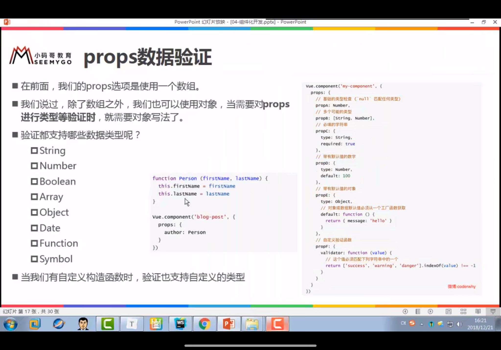
  
  - vue中props用驼峰标识可能会出现一些问题，尽量用-而不用驼峰式写法（踩坑时再记一下
  
  - 子组件通过事件向父组件发送消息
  
    在子组件中，通过$emit()来触发事件
  
    在父组件中，通过v-on来监听子组件事件
  
    ```js
    <!DOCTYPE html>
    <html lang="en">
    <head>
      <meta charset="UTF-8">
      <title>Title</title>
    </head>
    <body>
    
    <div id="app">
      <cpn @item-click="cpnClick"></cpn>
    </div>
    
    
    <template id="cpn">
    <div>
      <button v-for="item in catagories" @click="btnClick(item)">{{item.name}}</button>
    </div>
    </template>
    <script src="../js/vue.js"></script>
    
    <script>
    
      const cpn = {
        template:'#cpn',
        data(){
          return {
            catagories:[
              {id:'aaa',name:'热门推荐'},
              {id:'bbb',name:'手机数码'},
              {id:'ccc',name:'家用家电'},
              {id:'ddd',name:'电脑办公'},
            ]
          }
        },
        methods:{
          btnClick(item){
            //发射一个事件
            this.$emit('item-click',item)
          }
        }
      }
    
    
    
      const app = new Vue({
        el:'#app',
        data:{
          message:'hello'
        },
        components:{
          cpn
        },
        methods:{
          cpnClick(item){
            console.log('cpnClick',item)
          }
        }
      })
    </script>
    </body>
    </html>
    ```
  
    

## 父子组件通信案例

### 不使用v-model实现

```html
<!DOCTYPE html>
<html lang="en">
<head>
  <meta charset="UTF-8">
  <title>Title</title>
</head>
<body>
<div id="app">
  <cpn :number1="num1" :number2="num2" @num1change = "num1change" @num2change = "num2change"></cpn>
</div>


<template id="cpn">
  <div>
    <h2>props:{{number1}}</h2>
    <h2>data:{{dnumber1}}</h2>
<!--    <input type="text" v-model="dnumber1">-->
    <input type="text" :value="dnumber1" @input="num1Input">
    <h2>props:{{number2}}</h2>
    <h2>data:{{dnumber2}}</h2>
<!--    <input type="text" v-model="dnumber2">-->
    <input type="text" :value="dnumber2" @input="num2Input">

  </div>
</template>


<script src="../js/vue.js"></script>
<script>


  const app = new Vue({
    el:'#app',
    data:{
      num1:1,
      num2:0
    },
    components:{
      cpn:{
        template:'#cpn',
        props:{
          number1:Number,
          number2:Number,
        },
        data(){
          return {
            dnumber1:this.number1,
            dnumber2:this.number2
          }
        },

        methods:{
          num1Input(event){
            this.dnumber1 = event.target.value;
            this.$emit('num1change',this.dnumber1);
            this.dnumber2 = this.dnumber1*100;
            this.$emit('num2change',this.dnumber2)
          },
          num2Input(event){
            this.dnumber2 = event.target.value;
            this.$emit('num2change',this.dnumber2)
            this.dnumber1 = this.dnumber2/100;
            this.$emit('num1change',this.dnumber1)
          }
        }
      }
    },
    methods:{
      num1change(value){
        this.num1 = parseFloat(value);
      },
      num2change(value){
        this.num2 = parseFloat(value);
      }
    }
  })
</script>
</body>
</html>
```

### 使用watch实现

此时继续使用v-model，watch相当于监听数值的变化，当数值变化时执行相应命令

```html
<!DOCTYPE html>
<html lang="en">
<head>
  <meta charset="UTF-8">
  <title>Title</title>
</head>
<body>
<div id="app">
  <cpn :number1="num1" :number2="num2" @num1change = "num1change" @num2change = "num2change"></cpn>
</div>


<template id="cpn">
  <div>
    <h2>props:{{number1}}</h2>
    <h2>data:{{dnumber1}}</h2>
    <input type="text" v-model="dnumber1">
<!--    <input type="text" :value="dnumber1" @input="num1Input">-->
    <h2>props:{{number2}}</h2>
    <h2>data:{{dnumber2}}</h2>
    <input type="text" v-model="dnumber2">
<!--    <input type="text" :value="dnumber2" @input="num2Input">-->

  </div>
</template>


<script src="../js/vue.js"></script>
<script>


  const app = new Vue({
    el:'#app',
    data:{
      num1:1,
      num2:0
    },
    components:{
      cpn:{
        template:'#cpn',
        props:{
          number1:Number,
          number2:Number,
        },
        data(){
          return {
            dnumber1:this.number1,
            dnumber2:this.number2
          }
        },

        // methods:{
        //   num1Input(event){
        //     this.dnumber1 = event.target.value;
        //    
        //     this.dnumber2 = this.dnumber1*100;
        //     this.$emit('num2change',this.dnumber2)
        //   },
        //   num2Input(event){
        //     this.dnumber2 = event.target.value;
        //     this.$emit('num2change',this.dnumber2)
        //     this.dnumber1 = this.dnumber2/100;
        //     this.$emit('num1change',this.dnumber1)
        //   }
        // },
        watch:{
          dnumber1(newValue){
            this.dnumber2 = newValue*100;
            this.$emit('num1change',newValue);
          },
          dnumber2(newValue){
            this.dnumber1 = newValue/100;
            this.$emit('num2change',newValue)
          }
        }
      }
    },
    methods:{
      num1change(value){
        this.num1 = parseFloat(value);
      },
      num2change(value){
        this.num2 = parseFloat(value);
      }
    }
  })
</script>
</body>
</html>
```


## 父子组件互相访问：

- 父组件访问子组件：使用$children或$refs
- 子组件访问父组件：使用$parent

### $children

- this.$children是一个数组类型，它包含所有子组件对象

### $refs

- 拿到的是一个对象类型，每个子组件在html标签自定义一个ref属性


### $parent


### $root


## slot-插槽的基本使用

- 组件的插槽是为了让我们封装的组件更加具有扩展性
- 让使用者可以决定组件内部的一些内容到底展示什么

### 匿名插槽

```html
<!DOCTYPE html>
<html lang="en">
<head>
  <meta charset="UTF-8">
  <title>Title</title>
</head>
<body>
<div id="app">
  <cpn>
  </cpn>
  <cpn>
    <span>slot</span>
  </cpn>
  <cpn>
    <i>hhh</i>
  </cpn>
  <cpn></cpn>
</div>

<template id="cpn">
  <div>
    <h2>我是组件</h2>
    <p>我是组件的段落</p>
    <slot>
      <button>按钮</button>
    </slot>
  </div>
</template>
<script src="../js/vue.js"></script>
<script>
  const app = new Vue({
    el:'#app',
    data:{
      message:'hello'
    },
    components: {
      cpn:{
        template:'#cpn',

      }
    }
  })
</script>
</body>
</html>
```


### 具名插槽

```html
<!DOCTYPE html>
<html lang="en">
<head>
  <meta charset="UTF-8">
  <title>Title</title>
</head>
<body>
<div id="app">
  <cpn>
    <span slot="center">？？？</span>
  </cpn>
</div>

<template id="cpn">
  <div>
    <slot name="left">
      <span>左边</span>
    </slot>
    <slot name="center">
      <span>中间</span>
    </slot>
    <slot name="right">
      <span>右边</span>
    </slot>
    <slot>
      <button>按钮</button>
    </slot>
  </div>
</template>
<script src="../js/vue.js"></script>
<script>
  const app = new Vue({
    el:'#app',
    data:{
      message:'hello'
    },
    components: {
      cpn:{
        template:'#cpn',

      }
    }
  })
</script>
</body>
</html>
```


### 编译作用域

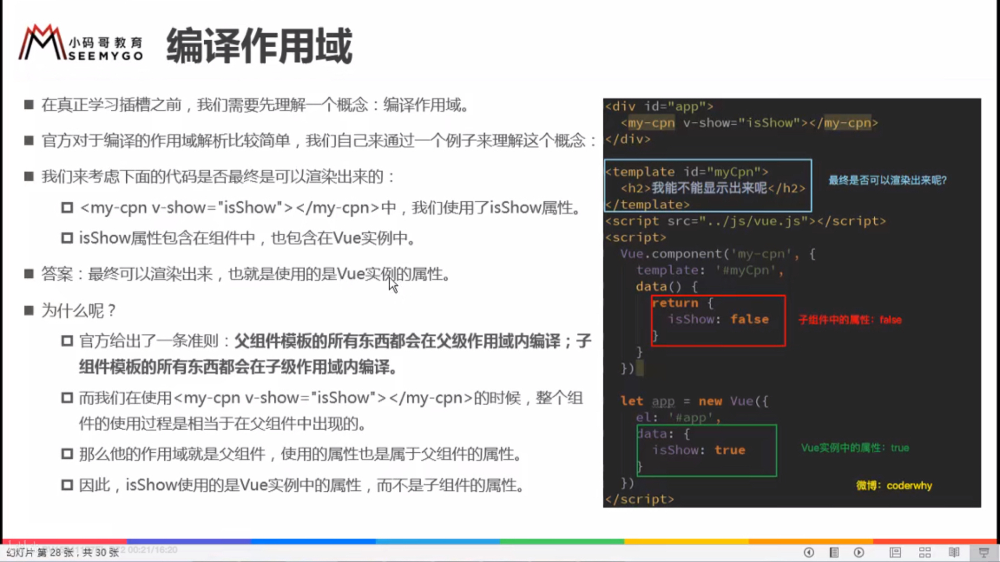

### 作用域插槽：（易踩坑）

- 父组件替换插槽的标签，但是内容由子组件来提供
- 在子组件的模板中的插槽后定义
- 注意版本问题导致的不同写法：slot-scope和v-slot

```html
<!DOCTYPE html>
<html lang="en" xmlns:v-slot="http://www.w3.org/1999/XSL/Transform">
<head>
  <meta charset="UTF-8">
  <title>Title</title>
</head>
<body>
<div id="app">
  <cpn></cpn>
  <cpn>
    <!--目的是获取子组件中的pLanguage-->
    <!--Vue2.5.x以下版本用template-->
    <!--成功-->
<!--    <template slot-scope="slot">-->
<!--      <span v-for="item in slot.data">{{item}}-</span>-->
<!--    </template>-->
    <!--try 2.5.x以上版本可以使用div-->
    <!--成功-->
<!--    <div slot-scope="slot">-->
<!--      <span v-for="item in slot.data">{{item}}*</span>-->
<!--    </div>-->
    <!--try 2.6以上版本可以使用v-slot-->
    <!--如果没命名插槽，则v-slot="xxx"是声明该slot作用域名为xxx，之后的数据调用为xxx.data-->
<!--    <template v-slot="scope">-->
<!--      <span v-for="item in scope.data">{{item}}*</span>-->
<!--    </template>-->
    <!--如果已经对插槽命名，将内容插入到对应的插槽并且获取子组件的数据，写法如下-->
    <template v-slot:normal="scope">
      <span v-for="item in scope.data">{{item}}*</span>
    </template>
  </cpn>
  <cpn></cpn>
</div>


<template id="cpn">
  <div>
    <slot name="normal" :data="pLanguages">
      <ul>
        <li v-for="item in pLanguages">{{item}}</li>
      </ul>
    </slot>
  </div>
</template>

<script src="../js/vue.js"></script>
<script>
  const app = new Vue({
    el:'#app',
    data:{
      message:'hello'
    },
    components:{
      cpn:{
        template:'#cpn',
        data(){
          return {
            pLanguages:['JavaScript','Java','Python','C#','Python','Go','Swift']
          }
        }
      }
    }
  })
</script>
</body>
</html>
```


# 前端模块化开发

## ES6的模块化实现

### export基本使用

- 单个导出

  ```
  export var num = 1000；
  ```

- 一并导出

  ```
  export {num1,num2}
  ```

- 导出函数和类

  ```
  export function sum(num1,num2){
  	return num1+num2
  }
  export class Person{
  
  }
  ```

- export default

### import基本使用

- 比较简单的略过
- 记住 import * as xxx from ‘path’


## webpack

### 安装

- webpack依赖node环境

- 本人使用yarn安装，进行全局安装（此处容易踩坑，如果是用npm安装的yarn，要配置环境变量才能顺利进行全局安装，解决方法为：

  1. 在cmd输入 yarn global bin 获取yarn的bin目录
  2. 将1中的bin目录添加到环境变量的path中
  3. 重启cmd
  4. 进行全局安装包

  ```
  yarn global add webpack@3.6.0
  ```

### 起步

- 最简单的打包方式：

  通过命令行跳转到项目index目录下,运行如下例子命令

  ```
  webpack ./src/main.js ./dist/bundle.js
  ```

  意思是将src目录下的main.js打包成bundle.js并且放到dist目录下，
  
  然后在index.html直接引入bundle.js就可以使用

### webpack的配置

- 在目录下创建一个名为webpack.config.js的文件，在该文件中进行webpack的配置

- 在cmd运行npm init，初始化项目，运行npm install webpack --save-dev从而让项目具有node环境

- 在webpack.config.js中写如下代码

  ```js
  const path = require('path')
  
  module.exports = {
    entry:'./src/main.js',
    output:{
      path:path.resolve(__dirname,'dist'),
      filename:'bundle.js'
    }
  }
  ```

- 直接在cmd运行webpack命令（此时用全局的webpack）

- （代替，将webpack命令和npm run命令映射）：在目录下的package.json的script下写build对应的命令webpack，然后运行npm run build命令，此时运行的webpack是项目内的webpack而不是全局的webpack

  ```
    "scripts": {
      "test": "echo \"Error: no test specified\" && exit 1",
      "build": "webpack"
    },
  ```


### webpack中使用css文件的配置

原生webpack只能处理js文件的依赖关系，处理css、vuw、jsx等文件需要扩展不同的loader

- loader使用过程
  1. 通过npm安装需要使用的loader
  2. 在webpack.config.js的modules关键字下进行配置
  
  ```js
  const path = require('path')
  
  module.exports = {
    entry:'./src/main.js',
    output:{
      path:path.resolve(__dirname,'dist'),
      filename:'bundle.js'
    },
    module:{
        //rules从下往上加载
      rules:[
        {
          test:/\.css$/,
          //css-loader只负责将css文件进行加载
          //style-loader负责将样式添加到DOM中
          //使用多个loader时，从右向左先后加载
          use:['style-loader','css-loader']
        }
      ]
    }
  }
  ```


### webpack中使用less文件的配置

```
npm install --save-dev less-loader -less
```

在webpack.config.js下module的rules下配置规则：

```
      {
        test:/\.less$/,
        use:[{
          loader:"style-loader"
        },
          {
            loader:"css-loader"
          },
          {
            loader:"less-loader"
          }]
      }
```


### webpack打包图片文件

```
npm install url-loader --save-dev
```

在webpack.config.js下配置：

```
const path = require('path')

module.exports = {
  entry:'./src/main.js',
  output:{
    path:path.resolve(__dirname,'dist'),
    filename:'bundle.js',
    publicPath:'dist/'//处理路径
  },
  module:{
    rules:[
      {
        test:/\.(png|jpg|gif|jpeg)$/,
        options:{
          //小于8192的图片文件会被编码成字符串
          limit:8192,
          //大于8192的图片被重命名打包到/dist/img,命名为原名.8位哈希码.扩展名
          name:'img/[name].[hash:8].[ext]'
        }
      }
    ]
  }
}
```


### es6转es5的babel

- 安装babel、babel core、babel-preset-es2015

```
npm install --save-dev babel-loader@7 babel-core babel-preset-es2015
```

- 配置webpack.config.js

```

```


# JS相关


## 易忘

1. 字符串转换成Int和Float：parseInt(String)/parseFloat(String)
2. 数组转换成字符串并且以一定字符连接：join方法：数组名.join(用来连接的符号)


## ES6新特性


## 高阶函数

### filter()

```
nums = [10,20,111,222,444,40,50]
//filter(callbackfn:(value T,index:number,array:T[])=>value is S,thisArg?:any):S[];
//filter中的回调函数有一个要求：必须返回一个boolean值，当返回true时，函数内部会自动将这次回调的n加入到新的数组中，当返回是false时，函数内部会过滤掉这次的n。
let newNums = nums.filter(function(n){
	return n<100;
});
console.log(newNums);
//10,20,40,50
```


### map

```
//map函数的使用
//返回数据的值
let new2Nums = newNums.map(function(n){
	return n*2
})
//new2Nums：20，40,80,100
```


### reduce

```
//reduce的使用
//作用：对数组中所有的内容进行汇总
//传两个参数时，第一个是回调函数，第二个是初始化值
let total = new2Nums.reduce(function(preValue,n){
	//preValue是上一次返回的值
	return preValue+n
}，0)
//执行以上时
//第一次：preValue:0 n:20
//第二次:preValue:20, n:40
//第三次:preValue:60 n:80
//4:preValue:140 n:100
//5:240
```


# 个人学习环境配置相关

## webpack

- 视频里使用3.6.0版本，全局安装